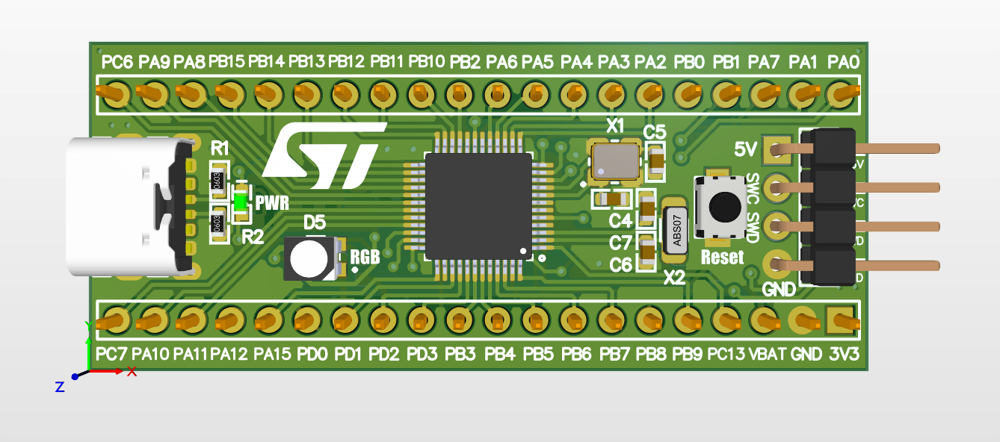

# STM32G030C8T6 Development Board

This is a development board based on the **STM32G030C8T6** microcontroller. It is built to offer a compact , user-friendly platform for prototyping and testing STM32G0 series applications.

## 💡 Features

- **Microcontroller:** STM32G030C8T6 (ARM Cortex-M0+, 64 KB Flash, 8 KB RAM)
- **Power Input:** USB Type-C connector
- **Voltage Regulator:** Onboard 3.3V regulator TLV74333 (powered via Type-C input)
- **Pin Access:** All GPIOs on standard 2.54mm pin headers
- **Clock Sources:**
  - 8 MHz external crystal oscillator
  - 32.768 kHz crystal for RTC or low-power applications
- **User Interface:**
  - One RGB LED connected to GPIOs (PD0 - PD2)
- **Form Factor:** Compact, breadboard-friendly design

## Applications

This board is ideal for:
- Learning STM32 microcontroller programming
- Rapid prototyping
- Embedded systems development
- Low-power applications

## License

This project is open-source and available under the MIT License. Feel free to use, modify, and share it.

## Author

Designed and maintained by [Mehrdad Qasemi Taj](https://github.com/Mehrdad-QasemiTaj)

